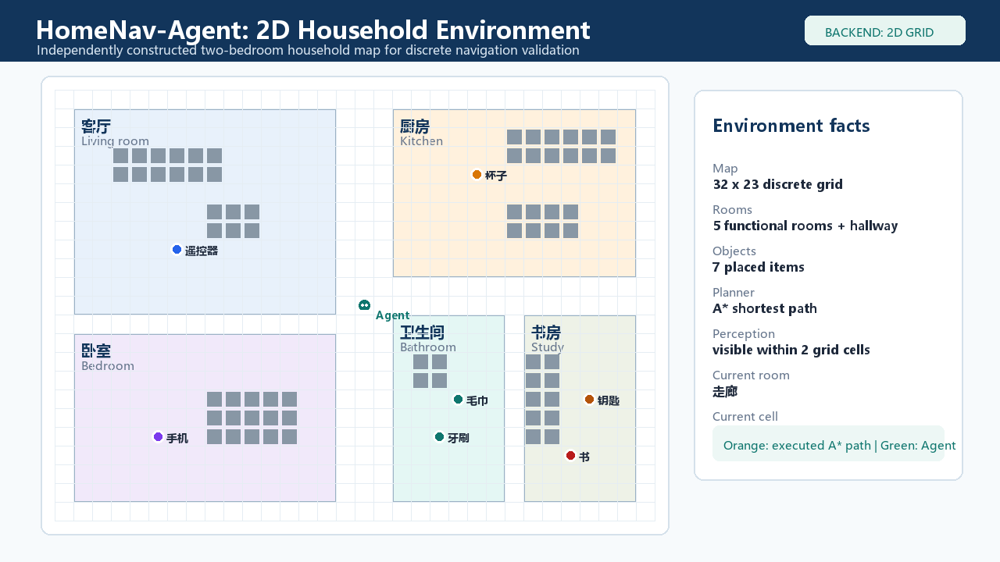
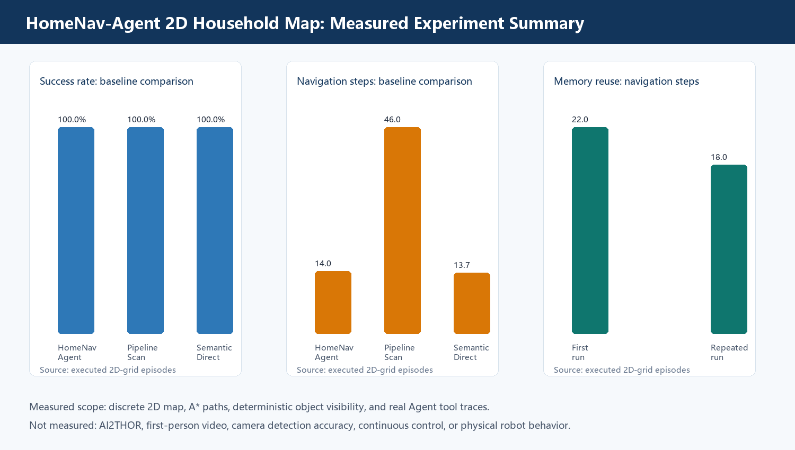
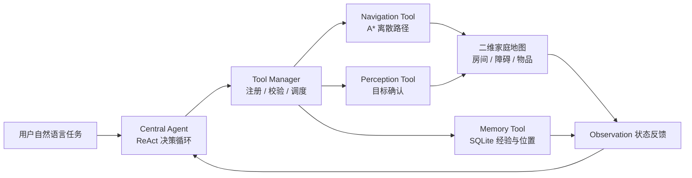

# HomeNav-Agent

面向家庭服务任务的 Agent-Tool 架构导航智能体。项目关注的不是“给定起点和终点后如何寻找路径”，而是让智能体从一句自然语言家庭需求出发，自主完成目标理解、工具选择、空间导航、目标确认和经验写回。

当前仓库使用二维离散家庭地图作为最小可控验证环境。它用于排除相机、连续运动和三维场景随机性等底层因素，集中验证上层决策闭环；后续可以通过相同工具接口接入 AI2-THOR 三维环境。

## 一句话理解项目

用户说“我有点口渴”时，系统会将需求解析为“寻找杯子”，查询家庭知识和历史记忆，调用导航工具规划至厨房的 A* 路径，再调用感知工具确认杯子，最后把已确认的位置写回 SQLite。

```text
自然语言需求
    -> Central Agent 任务解析
    -> Memory Tool 检索经验
    -> Navigation Tool 规划路径
    -> Perception Tool 独立确认目标
    -> Memory Tool 写回结果
```

这与普通 A* 寻路的区别在于：A* 只是被 Agent 调用的一个工具，系统还需要自主确定“要找什么”、判断“是否真的找到了”，并利用历史任务改进下一次执行。

## 项目亮点

1. **工具解耦**：Central Agent 不直接操作环境，记忆、导航和感知均通过独立接口调用；后续替换二维地图、AI2-THOR 或真实设备时，上层决策逻辑无需重写。
2. **独立成功判据**：到达目标房间不等于任务成功，必须由 Perception Tool 确认目标进入可见范围，避免“到达即成功”的伪结果。
3. **全链路可追溯**：工具参数、返回结果、状态变化、A* 路径和最终结论均保留在任务轨迹中，实验指标可回溯到逐回合原始数据。
4. **分层验证路线**：先验证可控环境中的任务规划和工具协同，再逐步替换为三维视觉与连续控制模块。

## 当前验证结果

数据来自仓库二维家庭地图上的实际程序运行，不代表 AI2-THOR、第一视角相机或实体机器人性能。

| 实验项目 | 结果 | 说明 |
| --- | ---: | --- |
| 任务覆盖 | 129 个回合 | 9 类任务，每类重复 3 次，包含显式物品和规则集内隐含需求 |
| 完整 Agent 成功率 | 100% | 18 个显式物品任务全部完成目标确认 |
| 隐含需求成功率 | 100% | “口渴”“观看电视”“刷牙”均完成当前规则映射下的任务 |
| 目标驱动 vs 逐房扫描 | 14.0 vs 46.0 步 | 平均导航步数减少 69.6%，体现目标驱动调度的效率优势 |
| 记忆复用 | 22.0 -> 18.0 步 | 手机任务重复执行时，持久记忆使路径减少 18.2% |
| 移除目标确认 | 0% 成功率 | 在“必须确认目标”的预注册判据下，无法形成可靠闭环 |

实验原始文件位于 `output/experiments/two_d_grid_final_20260805/`，包括 `summary.json`、`episode_metrics.csv`、`experiment_charts.png` 和 `raw_traces.json`。





## 系统架构



| 模块 | 代码位置 | 作用 |
| --- | --- | --- |
| Central Agent | `agent/central_agent.py` | ReAct 循环、任务状态和结束条件 |
| 输出解析与状态 | `agent/parser.py`、`agent/task_state.py` | 结构化 Action、子目标、观测与轨迹 |
| 工具管理器 | `tools/manager.py` | 工具注册、参数校验、计时和统一错误格式 |
| 记忆工具 | `tools/memory.py`、`memory/` | 查询、写回和维护 SQLite 长期记忆 |
| 导航工具 | `tools/navigation.py`、`models/two_d_environment.py` | 二维地图上的 A* 路径规划 |
| 感知工具 | `tools/perception.py`、`models/yolo_model.py` | 根据可见范围确认目标对象 |
| 二维渲染 | `models/two_d_renderer.py` | 生成地图、机器人图标和执行轨迹图 |
| AI2-THOR 适配 | `models/ai2thor_environment.py` | 预留三维环境接口，当前需单独安装运行环境 |
| 接口层 | `interfaces/cli.py`、`interfaces/api.py` | CLI 和 FastAPI 调用入口 |

## 环境要求

- Python 3.10 或更高版本
- Windows、Linux 或 macOS
- 二维验证不需要 GPU、AI2-THOR 或模型权重
- 使用 OpenAI LLM 时需要配置 `OPENAI_API_KEY`；不配置时使用确定性的 Mock LLM

## 安装

```bash
git clone <your-repository-url>
cd HomeNav-Agent

python -m venv .venv
# Windows PowerShell
.\.venv\Scripts\Activate.ps1
# Linux / macOS
# source .venv/bin/activate

python -m pip install --upgrade pip
python -m pip install -r requirements.txt
```

## 快速运行

```bash
python main.py "我有点口渴"
python main.py --trace "帮我找遥控器"
```

交互式模式：`python main.py`。

## 生成演示和实验数据

```bash
python scripts/generate_2d_grid_demo.py \
  --task "I am thirsty" \
  --output-dir output/two_d_demo
```

```bash
python scripts/run_2d_grid_experiments.py \
  --output-dir output/experiments/two_d_grid \
  --repetitions 3
```

演示目录会生成 `two_d_household_map.png`、`task_execution_preview.png`、`HomeNav-Agent_2D_Household_Demo.mp4` 和 `summary.json`。视频是二维离散工具轨迹的可视化，不是第一视角相机视频或实体机器人记录。

## REST API

```bash
python -m uvicorn interfaces.api:app --host 0.0.0.0 --port 8000
```

| 方法 | 路径 | 说明 |
| --- | --- | --- |
| `POST` | `/api/task/start` | 提交任务并返回任务 ID、结果和轨迹 |
| `GET` | `/api/task/{task_id}` | 查询任务状态和结果 |
| `GET` | `/api/task/{task_id}/trace` | 查询完整 Thought / Action / Observation 轨迹 |
| `GET` | `/api/tools` | 查询工具注册信息 |
| `GET` | `/api/system/status` | 查询当前后端和工具列表 |

## 测试

```bash
python -m unittest discover -s tests -v
```

测试覆盖输出解析、工具参数校验、记忆置信度更新、二维导航和完整 `Memory -> Navigation -> Perception -> Memory` 工作流。

## GitHub 上传建议

### 必须上传：可运行源码

```text
agent/              tools/              memory/
models/             interfaces/         config/
scripts/            tests/
main.py             requirements.txt    README.md
.gitignore
```

其中 `models/ai2thor_environment.py`、`scripts/run_ai2thor_validation.py` 虽然当前尚未完成三维实测，但应保留为后续 AI2-THOR 扩展接口和验证入口。

### 建议上传：少量展示资产

可以新增 `docs/assets/`，只放 `two_d_household_map.png`、`task_execution_preview.png` 和 `experiment_charts.png`。项目书或可研报告适合作为 Release 附件；MP4 体积较大，建议使用 GitHub Release、Git LFS 或网盘链接，不要直接堆在源码根目录。

### 不要上传

```text
.env                 # 密钥和本地配置
.venv/、homenav_env/  # 虚拟环境
__pycache__/、*.pyc   # Python 缓存
data/*.db             # 本地运行记忆数据库
tmp/                  # 文档和渲染临时文件
output/**/raw/        # 大量实验 SQLite 原始数据库
```

## 研究边界与后续计划

当前实验只证明二维离散环境中的任务规划、工具协同、目标确认和记忆复用。隐含需求采用可配置常识映射，尚不代表开放域自然语言理解；目标确认使用结构化对象状态，尚不代表真实相机检测精度。

下一阶段保持 Central Agent 和工具协议不变，替换三个底层部分：

1. 用 AI2-THOR 场景和三维路径规划替换二维环境；
2. 用第一视角视觉检测或视觉语言模型替换结构化感知；
3. 增加连续移动、转向、碰撞处理、随机场景和视频评测。
